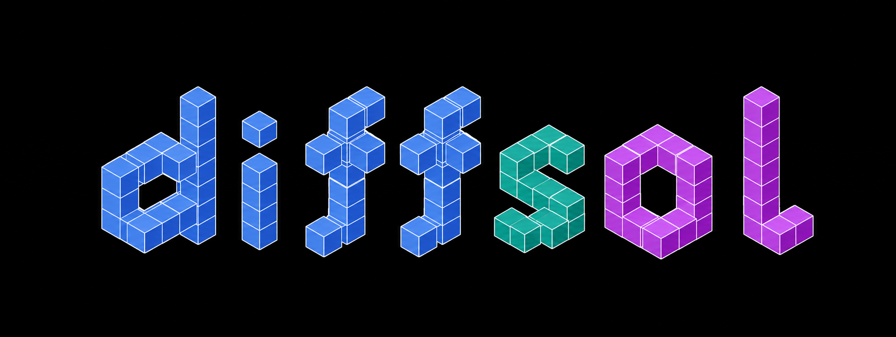

<p align="center">
  
</p>

JAX wrapper around [diffsol](https://github.com/martinjrobins/diffsol), a Rust ODE solver library.
Exposes diffsol's ODE solvers via `jax.ffi` so they can be called from inside `jax.jit` and
differentiated with `jax.grad`.

The user writes an RHS function in Python, which gets lowered to a
[diffsl](https://martinjrobins.github.io/diffsl/) source string and compiled on first call.

## Example usage

```python
import jax
import jax.numpy as jnp
from diffsol_jax import ODEProblem

def lotka_volterra(t, y, p):
    x, yy = y[0], y[1]
    alpha, beta, delta, gamma = p[0], p[1], p[2], p[3]
    return (alpha * x - beta * x * yy, delta * x * yy - gamma * yy)

params = jnp.array([1.5, 1.0, 0.75, 3.0])
y0     = jnp.array([1.0, 0.5])

problem = ODEProblem(lotka_volterra, y0=y0, params=params)

t_span = jnp.array([0.0, 10.0])
ts, ys = jax.jit(lambda p: problem.solve(p, t_span))(params)
# ts: float64[200],  ys: float64[200, 2]
```

## Limitations

- CPU only
- No vmap batching rule; `vmap_method="sequential"` gives correct results via a Python loop.
- The DiffSL lowerer handles elementwise ops and the common ODE patterns (Lotka-Volterra, Lorenz).
  Operations like `dot_general`, `reduce_sum`, and `concatenate` are not supported, so neural ODEs
  are not supported yet.
- Differentiation uses JAX-level forward sensitivities (no separate adjoint pass). DiffSL modules
  are JIT-compiled with Cranelift and cached per source string; the first call compiles, subsequent
  calls reuse the compiled module and update parameters via `set_params`.
- Does not work with `jax.pmap`
- Higher-order derivatives
